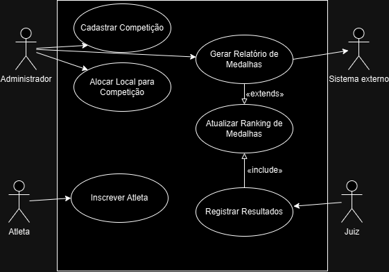
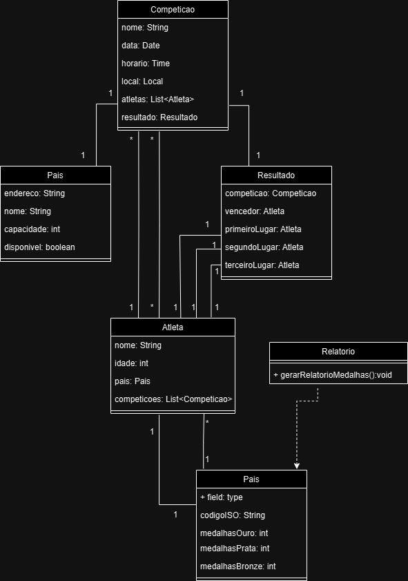
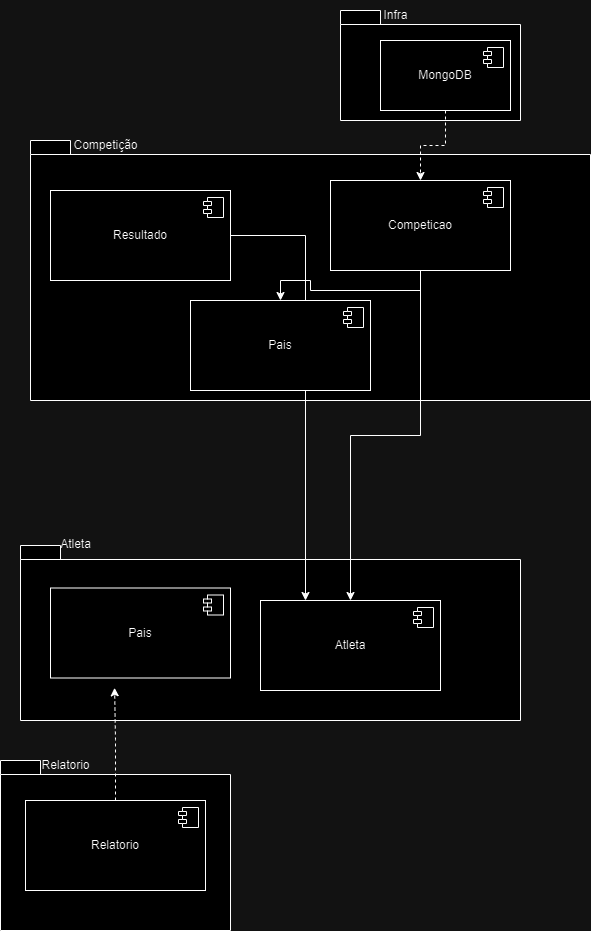
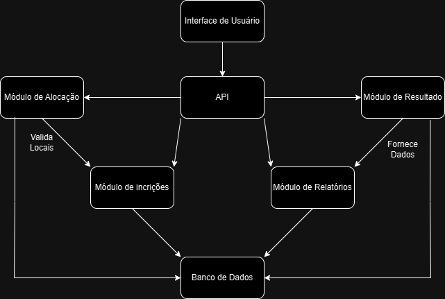
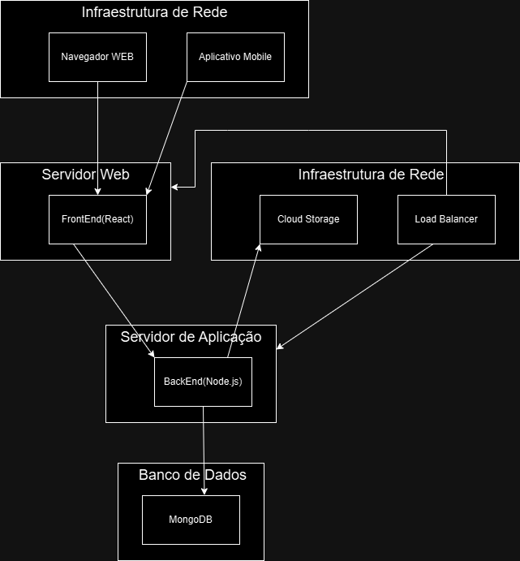

# Sistema de Gestão de Competições

Este repositório contém a modelagem UML do Sistema de Gestão de Competições, que permite a administração e controle de competições, inscrições de atletas, alocação de locais e registro de resultados. O sistema está dividido em vários módulos que interagem entre si de forma a garantir uma gestão eficiente e organizada.

## Contribuidores

-  Davi Augusto Dias Soares
-  Luisa Clara de Paula Lara Silva

## Instruções 

As instruções do que foi solicitado se encontra [AQUI](Instruções-Trabalho-SGO.pdf)

## Objetivo

O objetivo deste projeto é criar uma documentação completa da estrutura do sistema, utilizando diagramas UML para representar as interações, classes, pacotes, componentes e implantação. A modelagem visa fornecer uma visão clara do funcionamento do sistema, sem a necessidade de implementação do código.

## Estrutura do Repositório

O repositório contém os seguintes arquivos e diretórios:

/imagens                    
├── diagrama-de-caso-de-uso.png           
├── diagrama-de-classes.png        
├── diagrama-de-pacotes.png         
├── diagrama-de-componentes.png         
└── diagrama-de-implantacao.png             

/modelagens        
├──diagrama-de-caso-de-uso.drawio        
├── diagrama-de-classes.drawio           
├── diagrama-de-pacotes.drawio            
├── diagrama-de-componentes.drawio           
└── diagrama-de-implantacao.drawio                 

## Histórias de Usuário

### US01 - Cadastro de Competição
Como **organizador da competição**, desejo **cadastrar uma competição** para poder **administrar as informações de uma competição esportiva**.

### US02 - Inscrição de Atleta
Como **atleta**, desejo **me inscrever em uma competição** para poder **participar da competição e competir nas modalidades desejadas**.

### US03 - Alocação de Local
Como **organizador da competição**, desejo **alocar locais para as competições** para que **os eventos ocorram de forma organizada nos espaços adequados**.

### US04 - Registro de Resultados
Como **organizador da competição**, desejo **registrar os resultados dos atletas nas competições** para **acompanhar o desempenho dos atletas e gerar relatórios**.

---
## Diagramas UML

### Diagrama de Caso de Uso

### Diagrama de Classes e de Pacotes

### Diagrama de Componentes

### Diagrama de Implantação

## Modelagens

Os diagramas estão disponíveis nos seguintes arquivos de modelagem, que podem ser abertos com ferramentas como **Draw.io** ou **Astah**:

- [diagrama-de-caso-de-uso.drawio](modelagens/diagrama-de-caso-de-uso.drawio)
- [diagrama-de-classes.drawio](modelagens/diagrama-de-classes.drawio)
- [diagrama-de-pacotes.drawio](modelagens/diagrama-de-pacotes.drawio)
- [diagrama-de-componentes.drawio](modelagens/diagrama-de-componentes.drawio)
- [diagrama-de-implantacao.drawio](modelagens/diagrama-de-implantacao.drawio)
